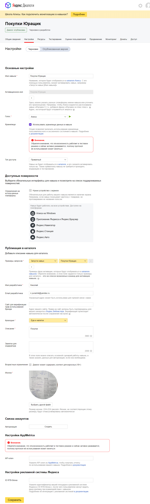
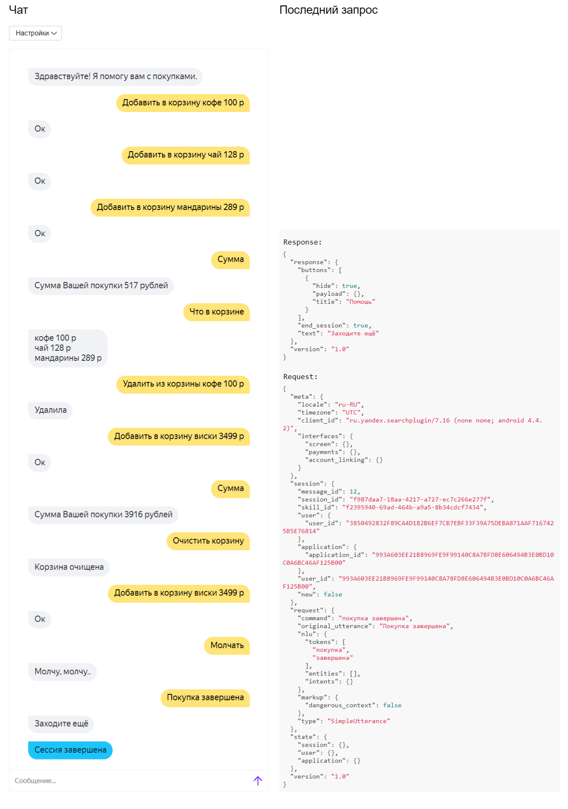
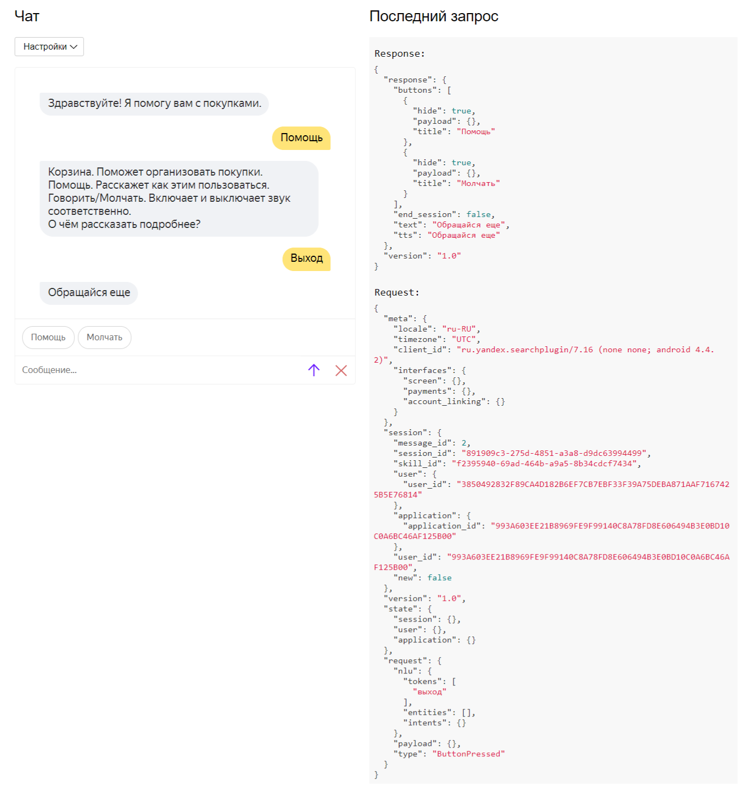
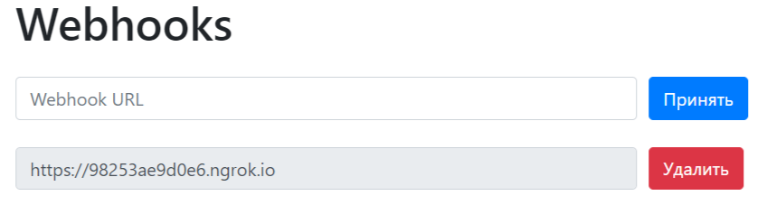

<p align="center">МИНИСТЕРСТВО НАУКИ  И ВЫСШЕГО ОБРАЗОВАНИЯ РОССИЙСКОЙ ФЕДЕРАЦИИ<br>
Федеральное государственное автономное образовательное учреждение высшего образования<br>
"КРЫМСКИЙ ФЕДЕРАЛЬНЫЙ УНИВЕРСИТЕТ им. В. И. ВЕРНАДСКОГО"<br>
ФИЗИКО-ТЕХНИЧЕСКИЙ ИНСТИТУТ<br>
Кафедра компьютерной инженерии и моделирования</p>
<br>
<h3 align="center">Отчёт по лабораторной работе № 2<br> по дисциплине "Программирование"</h3>
<br><br>
<p>студента 1 курса группы ПИ-б-о-201(1)<br>
Юращик Николай Александрович<br>
направления подготовки 09.03.04 "Программная инженерия"</p>
<br><br>
<table>
<tr><td>Научный руководитель<br> старший преподаватель кафедры<br> компьютерной инженерии и моделирования</td>
<td>(оценка)</td>
<td>Чабанов В.В.</td>
</tr>
</table>
<br><br>
<p align="center">Симферополь, 2020</p>
<hr>

# Лабораторная работа №2 Алиса
**Постановка задачи:**
1.  Разработать и зарегистрировать навык для Алисы на сервисе Яндекс.Диалоги;
2.  В качестве backend-a для навыка реализовать приложение на языке С++ выполняющее следующие функции:
    1.  Составление продуктовой корзины:
        -   Добавление продукта в корзину;
        -   Удаление продукта из корзины;
        -   Очистка корзины;
        -   Вывод списка товаров в корзине;
        -   Подсчёт стоимости товаров в корзине.
    2.  Вывод справочной информации по навыку;
    3.  Регистрацию webhook-ов сторонних сервисов;
    4.  Отправку данных на сторонние сервисы.
3.  В качестве стороннего сервиса реализовать приложение на языке Python выполняющее следующие функции:
    1.  Ожидание данных о покупке;
    2.  Сохранение поступивших данных в excel-документ.

**Цель работы:** 
1.  Получить представления о структуре post-запроса;
2.  Изучить webhooks как метод взаимодействия web-приложений;

## Ход работы

### 1. Настройка
На странице https://dialogs.yandex.ru/developer нажимаем кнопку "Создать диалог", а далее "Навык в Алисе", после чего попадаем в настройки навыка; Тут необходимо заполниить поля формы (рис. 1) в соответствии с документацией, сохранить и опубликовать настройки диалога.


Рис. 1. Страница настроек навыка
### 2. Корзина
Корзина использует сессионные данные для хранения выбранных пользователем названий и цен товаров. Функция "Очистить корзину" очищает поле "check" в данных сессии, команда "Добавить в корзину" добавляет в корзину название и его цену, "Удалить из корзины" -  убирает из корзины указанный объект, "Что в корзине" - выводит все товары в формате: Название + цена, "Сумма" - сообщает суммарную стоимость всех товаров пользователю (рис. 2).


Рис. 2. Демонстрация функционала
### 3. Помощь
Если пользователь нажал кнопку "Помощь", то режим навыка переключается в режим помощи, а затем перечисляются все команды и их краткое описание. Для того чтобы отобразить детальную справку по команде, необходимо ввести необходимую команду или нажать на соответствующую кнопку (рис. 3).


Рис. 3. Демонстрация функционала функции "Помощь"
### 4. Управление списком WebHook-служб
При подключении к "/webhooks" на сервере, программа автоматически изменяет локальный файл "template.html" и редактирует соответствующие поля с блоками URL-адресов, подставляя в каждый из них информацию из файла "block.html", а затем возвращает браузеру html-документ (рис. 4). При добавлении или удалении соответствующего WebHook-а, браузер посылает POST-запрос на тот же URL серверу. Затем серверное приложение обрабатывает запрос и совершает необходимое действие, после чего обновляет страницу.


Рис. 4. Страница управления webhook-ами
### 5. Заполнение Excel-файла
Для работы с Excel-документом клиентское приложение использует модуль Openpyxl для Python. Клиент получает с помощью модуля Flask json-строку с сервера C++. Затем происходит запись данных в буфер, также записывается дата отправки запроса. Буфер очищается, когда количество записей достигнет тысячи, а затем записывается в Excel документ.
Ссылка на Excel документ: [./Python/data.xlsx](./Python/data.xlsx)
### 6. Клиентское приложение
Для создания клиентского приложения использовался язык Python, весь исходный код хранится в одном файле. Использовались библиотеки Openpyxl и Flask. Приложение ждет запроса сервера и получает от него данные о покупке пользователя. Исходный код приложения:
```py
from flask import Flask, request
import openpyxl
import os.path
import datetime

app = Flask(__name__)

pwd = os.path.abspath(os.path.dirname(__file__))
cache_size = 1000
cache = []

def to_file():
    global cache
    book = None
    excel_db = os.path.join(pwd, 'data.xlsx')
    
    if not os.path.exists(excel_db):
        book = openpyxl.Workbook()
        
        book.active['A1'] = 'N'
        book.active['B1'] = 'User ID'
        book.active['C1'] = 'Datetime'
        book.active['D1'] = 'Item'
        book.active['E1'] = 'Price'
        book.save(excel_db)
    else:
        book = openpyxl.open(excel_db)

    sheet = book.active
    cur_time = datetime.datetime.utcnow()
    max_row = len(sheet['A'])
    row = max_row + 1

    for dataset in cache:
        id = dataset['user_id']
        for product in dataset['check']:
            sheet[row][0].value = row - 1
            sheet[row][1].value = id
            sheet[row][2].value = cur_time
            sheet[row][3].value = product['item']
            sheet[row][4].value = product['price']
            row += 1

    book.save(excel_db)
    book.close()

@app.route('/', methods=['POST'])
def index():
    global cache
    cache += [request.json]

    if (len(cache) > cache_size):
        to_file()
        cache = []

    return 'OK'

```
### 7. Серверное приложение
Для запуска сервера, был использован язык C++, а также сторонние библиотеки: httplib (для работы с HTTP-клиентом и HTTP-сервером), nlohmann/JSON (позволяет работать с JSON-файлами). Если приходит GET запрос на "/webhooks", сервер формирует и отправляет html-страницу со списком webhook-ов. Если POST запрос приходит на "/", сервер формирует и отправляет json-файл с ответными данными на Яндекс.Диалоги. Исходный код приложения:

```c++
#include <iostream>
#include <string>
#include <cpp_httplib/httplib.h>
#include <nlohmann/json.hpp>
#include <vector>
#include <map>

using namespace httplib;
using json = nlohmann::json;
std::vector<std::string> cache;
std::vector<std::string> webhooks;
typedef std::map<std::string, std::string> new_Map;

json session_list;
new_Map session_list_map;
bool help_pressed = false;

std::string log_file_name = "logs.txt";
std::ofstream log_file(log_file_name);

json button_speak = { {"title", "Говори"}, {"payload", json::object()}, {"hide", true} };
json button_silent = { {"title", "Молчать"}, {"payload", json::object()}, {"hide", true} };
json buttons_help = {
				{{"title", "Молчать"}, {"payload", json::object()}, {"hide", true}},
				{{"title", "Говори"}, {"payload", json::object()}, {"hide", true}},
				{{"title", "Помощь"}, {"payload", json::object()}, {"hide", true}},
				{{"title", "Добавить в корзину"}, {"payload", json::object()}, {"hide", true}},
				{{"title", "Удалить из корзины"}, {"payload", json::object()}, {"hide", true}},
				{{"title", "Что в корзине"}, {"payload", json::object()}, {"hide", true}},
				{{"title", "Сумма"}, {"payload", json::object()}, {"hide", true}},
				{{"title", "Покупка завершена"}, {"payload", json::object()}, {"hide", true}},
				{{"title", "Выход"}, {"payload", json::object()}, {"hide", true}}
};

void findAndRepl(std::string& data, std::string toSearch, std::string replStr) {
	size_t pos = data.find(toSearch);
	while (pos != std::string::npos) {
		data.replace(pos, toSearch.size(), replStr);
		pos = data.find(toSearch, pos + replStr.size());
	}
}

void webhooks_resp(std::string user_id, json cart) {
	json jcart = json::array();

	for (std::string item : cart) {
		std::string sep = u8R"( )";
		std::string temp;
		size_t sep_size = sep.length();
		json jcart_temp = json::array();

		while (true) {
			temp = item.substr(0, item.find(sep));
			if (temp.size() != 0)			jcart_temp.push_back(temp);
			if (temp.size() == item.size()) break;
			else							item = item.substr(temp.size() + sep_size);
		}

		jcart.push_back({ {"item",jcart_temp[0]}, {"price",jcart_temp[1]} });
	}

	json response = {
		{"user_id", user_id},
		{"check", jcart}
	};

	log_file << response;

	for (std::string link : cache) {
		findAndRepl(link, "https://", "http://");

		if (link[link.size() - 1] != '/')
		{
			link.push_back('/');
		}

		Client cli(link.substr(0, link.find('/', 7)).c_str());
		cli.Post(link.substr(link.find('/', 7), std::string::npos).c_str(), response.dump(), "application/json; charset=UTF-8");
	}
}

// В этой функции формируем ответ сервера на запрос
json gen_response(const std::string& text,
	const std::string& tts,
	const json buttons,
	const std::string session_id,
	bool end_session = false
)
{
	json response = {
		{"response", {
			{"buttons", buttons},
			{"end_session", end_session}
		}},
		{"version", "1.0"}
	};

	if (text != "")
	{
		response["response"]["text"] = text;
	}

	if (!session_id.empty() && end_session == false) {
		if (session_list[session_id]["speak"])
		{
			if (tts != "")
			{
				response["response"]["tts"] = tts;
			}
			if (!session_list[session_id]["help"]) {
				response["response"]["buttons"].push_back(button_silent);
			}
		}
		else if (!session_list[session_id]["speak"] && !session_list[session_id]["help"])
		{
			response["response"]["buttons"].push_back(button_speak);
		}
	}

	return response;
}

void request_processing(const Request& req, Response& res) {
	json j = json::parse(req.body);
	std::string mode;
	json str;

	std::string session_id = j["session"]["session_id"];

	if (j["session"]["new"]) {
		std::string text = u8R"(Здравствуйте! Я помогу вам с покупками.)";
		json buttons = {
			{ {"title", "Помощь"}, {"payload", json::object()}, {"hide", true} }
		};

		session_list_map.emplace(session_id, "1");
		session_list[session_id] = json::object();
		session_list[session_id]["speak"] = true;
		session_list[session_id]["help"] = false;
		session_list[session_id]["sum"] = "0";
		session_list[session_id]["cart"] = json::array();

		str = gen_response(text, text, buttons, session_id);
		res.set_content(str.dump(), "text/json; charset=UTF-8");
	}
	else {
		bool breaking = 1;
		for (auto session : session_list_map)
		{
			if (session.first == session_id)
			{
				breaking = 0;
			}
		}
		if (breaking == 1) {
			std::string text = u8R"(Ошибка, данные не корректны. Попробуйте еще раз.)";
			json buttons = {
			{ {"title", "Помощь"}, {"payload", json::object()}, {"hide", true} }
			};
			str = gen_response(text, text, buttons, session_id, true);
			res.set_content(str.dump(), "text/json; charset=UTF-8");
		}
		// Молчать
		if (j["request"]["nlu"]["tokens"][0] == u8"молчать") {
			if (!session_list[session_id]["help"]) {
				session_list[session_id]["speak"] = false;
				std::string text = u8R"(Молчу, молчу..)";
				json buttons = {
					{ {"title", "Помощь"}, {"payload", json::object()}, {"hide", true} }
				};
				str = gen_response(text, text, buttons, session_id);
				res.set_content(str.dump(), "text/json; charset=UTF-8");
			}
			else {
				std::string text = u8R"(Вызовите эту команду чтобы я не разговаривала. О чем еще рассказать?)";
				str = gen_response(text, text, buttons_help, session_id);
				res.set_content(str.dump(), "text/json; charset=UTF-8");
			}
		}
		// Помощь
		else if (j["request"]["nlu"]["tokens"][0] == u8"помощь") {
			if (!session_list[session_id]["help"]) {
				session_list[session_id]["help"] = true;
				std::string text = u8R"(Корзина. Поможет организовать покупки.
Помощь. Расскажет как этим пользоваться.
Говорить/Молчать. Включает и выключает звук соответственно.
О чём рассказать подробнее?)";
				str = gen_response(text, text, buttons_help, session_id);
				res.set_content(str.dump(), "text/json; charset=UTF-8");
			}
			else {
				std::string text = u8R"(Помощь расскажет как пользоваться данным навыком. О чем еще рассказать?)";
				str = gen_response(text, text, buttons_help, session_id);
				res.set_content(str.dump(), "text/json; charset=UTF-8");
			}
		}
		// Говорить
		else if (j["request"]["nlu"]["tokens"][0] == u8"говори") {
			if (!session_list[session_id]["help"]) {
				session_list[session_id]["speak"] = true;
				std::string text = u8R"(Ок, буду говорить)";
				json buttons = {
					{ {"title", "Помощь"}, {"payload", json::object()}, {"hide", true} }
				};
				str = gen_response(text, text, buttons, session_id);
				res.set_content(str.dump(), "text/json; charset=UTF-8");
			}
			else {
				std::string text = u8R"(Вызовите эту команду чтобы я снова могла говорить. О чем еще рассказать?)";
				str = gen_response(text, text, buttons_help, session_id);
				res.set_content(str.dump(), "text/json; charset=UTF-8");
			}
		}
		// Завершение покупки
		else if (j["request"]["nlu"]["tokens"][0] == u8"покупка" || j["request"]["nlu"]["tokens"][0] == u8"завершить" || j["request"]["nlu"]["tokens"][0] == u8"купить") {
			if (!session_list[session_id]["help"]) {
				std::string text = u8R"(Заходите ещё)";
				json buttons = {
				{ {"title", "Помощь"}, {"payload", json::object()}, {"hide", true} }
				};

				webhooks_resp(j["session"]["user"]["user_id"], session_list[session_id]["cart"]);

				json arr = json::object();
				
				for (auto session_old = session_list_map.begin(); session_old != session_list_map.end();)
				{
					if (session_old->first == session_id)
					{
						session_old = session_list_map.erase(session_old);
					}
					else if(session_id != session_old->first){
						arr.push_back(session_list);
					}
					else
					{
						++session_old;
					}
				}
				session_list = arr;

				str = gen_response(text, text, buttons, session_id, true);
				res.set_content(str.dump(), "text/json; charset=UTF-8");
			}
			else {
				std::string text = u8R"(Эта команда завершает работу с Вашей корзиной. О чем еще рассказать?)";
				str = gen_response(text, text, buttons_help, session_id);
				res.set_content(str.dump(), "text/json; charset=UTF-8");
			}
		}
		// Что в корзине
		else if (j["request"]["nlu"]["tokens"][0] == u8"что") {
			if (!session_list[session_id]["help"]) {
				std::string text;
				for (auto item_old : session_list[session_id]["cart"]) {
					text += item_old;
					text += "\n";
				}
				if (text.empty()) {
					text = u8R"(Корзина пуста, Вы ничего не добавили)";
				}
				json buttons = {
					{ {"title", "Помощь"}, {"payload", json::object()}, {"hide", true} }
				};
				str = gen_response(text, text, buttons, session_id);
				res.set_content(str.dump(), "text/json; charset=UTF-8");
			}
			else {
				std::string text = u8R"(Запросите эту команду чтобы узнать что уже есть в Вашей корзине. О чем еще рассказать?)";
				str = gen_response(text, text, buttons_help, session_id);
				res.set_content(str.dump(), "text/json; charset=UTF-8");
			}
		}
		// Добавить в корзину
		else if (j["request"]["nlu"]["tokens"][0] == u8"добавить") {
			if (!session_list[session_id]["help"]) {
				std::string good_name = j["request"]["nlu"]["tokens"][3];
				std::string good_price = j["request"]["nlu"]["tokens"][4];
				std::string good_val = j["request"]["nlu"]["tokens"][5];
				std::string good = good_name + " " + good_price + " " + good_val;

				session_list[session_id]["cart"].push_back(good);

				std::string s = session_list[session_id]["sum"];
				int a = std::stoi(s);
				int i = std::stoi(good_price);
				session_list[session_id]["sum"] = std::to_string(a + i);

				std::string text = u8R"(Ок)";
				json buttons = {
					{ {"title", "Помощь"}, {"payload", json::object()}, {"hide", true} }
				};
				str = gen_response(text, text, buttons, session_id);
				res.set_content(str.dump(), "text/json; charset=UTF-8");
			}
			else {
				std::string text = u8R"(Назовите эту команду чтобы я добавила товар в корзину (шаблон: Добавить в корзину "товар" "цена"). О чем еще рассказать?)";
				str = gen_response(text, text, buttons_help, session_id);
				res.set_content(str.dump(), "text/json; charset=UTF-8");
			}
		}
		// Удалить из корзины
		else if (j["request"]["nlu"]["tokens"][0] == u8"удалить") {
			if (!session_list[session_id]["help"]) {
				bool is_item = false;
				std::string item_name = j["request"]["nlu"]["tokens"][3];
				std::string item_price = j["request"]["nlu"]["tokens"][4];
				std::string item_val = j["request"]["nlu"]["tokens"][5];
				std::string item = item_name + " " + item_price + " " + item_val;

				json arr = json::array();
				for (auto item_old : session_list[session_id]["cart"]) {
					if (item != item_old) {
						arr.push_back(item_old);
					}
					else {
						is_item = true;
					}
				}
				session_list[session_id]["cart"] = arr;

				std::string s = session_list[session_id]["sum"];
				int a = std::stoi(s);
				int i = std::stoi(item_price);
				session_list[session_id]["sum"] = std::to_string(a - i);

				std::string text;
				if (is_item) {
					text = u8R"(Удалила)";
				}
				else {
					text = u8R"(Такого товара нет в корзине, попробуйте еще раз)";
				}

				json buttons = {
					{ {"title", "Помощь"}, {"payload", json::object()}, {"hide", true} }
				};
				str = gen_response(text, text, buttons, session_id);
				res.set_content(str.dump(), "text/json; charset=UTF-8");
			}
			else {
				std::string text = u8R"(Назовите эту команду чтобы я удалила товар из корзины (шаблон: Удалить из корзины "товар" "цена"). О чем еще рассказать?)";
				str = gen_response(text, text, buttons_help, session_id);
				res.set_content(str.dump(), "text/json; charset=UTF-8");
			}
		}
		// Очистить корзину
		else if (j["request"]["nlu"]["tokens"][0] == u8"очистить") {
			if (!session_list[session_id]["help"]) {
				session_list[session_id]["cart"] = json::array();
				std::string text = u8R"(Корзина очищена)";
				json buttons = {
					{ {"title", "Помощь"}, {"payload", json::object()}, {"hide", true} }
				};
				session_list[session_id]["sum"] = "0";
				str = gen_response(text, text, buttons, session_id);
				res.set_content(str.dump(), "text/json; charset=UTF-8");
			}
			else {
				std::string text = u8R"(Вызовите эту команду чтобы я очистила Вашу корзину. О чем еще рассказать?)";
				str = gen_response(text, text, buttons_help, session_id);
				res.set_content(str.dump(), "text/json; charset=UTF-8");
			}
		}
		// Сумма покупки
		else if (j["request"]["nlu"]["tokens"][0] == u8"сумма") {
			if (!session_list[session_id]["help"]) {
				std::string s = session_list[session_id]["sum"];
				std::string text = u8R"(Сумма Вашей покупки )" + s + u8R"( рублей)";
				json buttons = {
					{ {"title", "Помощь"}, {"payload", json::object()}, {"hide", true} }
				};
				str = gen_response(text, text, buttons, session_id);
				res.set_content(str.dump(), "text/json; charset=UTF-8");
			}
			else {
				std::string text = u8R"(Вызови эту команду чтобы я назвала сумму Вашей покупки. О чем еще рассказать?)";
				str = gen_response(text, text, buttons_help, session_id);
				res.set_content(str.dump(), "text/json; charset=UTF-8");
			}
		}
		// Выход из помощи
		else if (j["request"]["nlu"]["tokens"][0] == u8"выход") {
			session_list[session_id]["help"] = false;
			std::string text = u8R"(Обращайся еще)";
			json buttons = {
				{ {"title", "Помощь"}, {"payload", json::object()}, {"hide", true} }
			};
			str = gen_response(text, text, buttons, session_id);
			res.set_content(str.dump(), "text/json; charset=UTF-8");
		}
		else {
			std::string text = u8R"(Не понимаю, попробуй еще)";
			json buttons = {
				{ {"title", "Помощь"}, {"payload", json::object()}, {"hide", true} }
			};
			str = gen_response(text, text, buttons, session_id);
			res.set_content(str.dump(), "text/json; charset=UTF-8");
		}
	}
}

void update_conf(std::string param, std::string val) {
	std::string conf_file_name = "conf.json";
	std::ifstream conf_file(conf_file_name);
	std::string config;
	json j;

	if (conf_file.is_open())
	{
		conf_file >> j;
		conf_file.close();

		if (param == "del") {
			cache.erase(std::remove(cache.begin(), cache.end(), val), cache.end());
		}
		else if (param == "set") {
			cache.push_back(val);
		}
		json j2;
		j2["webhooks"] = cache;
		std::ofstream conf_file(conf_file_name);
		conf_file << j2;
		conf_file.close();
	}
	else
	{
		std::cout << "Error open file 3";
	}
}

void check_conf() {
	std::string conf_file_name = "conf.json";
	std::ifstream conf_file(conf_file_name);
	std::string config;
	std::cout << u8"Попытка открыть файл...\n";
	if (conf_file.is_open())
	{
		int i = 0;
		std::cout << u8"Открыл!\n";
		json j = json::parse(conf_file);

		for (int i = 0; i < j["webhooks"].size(); i++) {
			cache.push_back(j["webhooks"][i]);
			std::cout << j["webhooks"][i] << std::endl;
		}
	}
	else
	{
		std::cout << u8"Не получилось, создаю новый...\n";
		std::ofstream conf_file(conf_file_name);
		std::string config = u8R"(
{
"webhooks":[]
})";
		conf_file << config;
		conf_file.close();
		cache = {};
	}
}

void gen_response_webhooks(const Request& req, Response& res) {


	std::string template_file_name = "template.html";
	std::ifstream template_file(template_file_name);
	std::string template_str;

	//Читаем шаблон
	if (template_file.is_open())
	{
		getline(template_file, template_str, '\0');
		template_file.close();
	}
	else
	{
		std::cout << "Error open file";
	}

	//Формируем html-шаблон Webhooks
	if (cache.empty()) {
		findAndRepl(template_str, "{webhooks_list}", "");
	}
	else {
		std::string template_file_name = "templ_block.html";
		std::ifstream template_file_block(template_file_name);
		std::string template_block;
		std::string temp;

		for (int i = 0; i < cache.size(); i++) {
			if (template_file_block.is_open())
			{
				getline(template_file_block, template_block, '\0');
				temp = template_block;
			}
			else {
				std::cout << "Error open file 2";
			}
			findAndRepl(temp, "{Webhook URL}", cache[i]);

			findAndRepl(template_str, "{webhooks_list}", temp);
		}
		template_file_block.close();
		findAndRepl(template_str, "{webhooks_list}", "");
	}

	res.set_content(template_str, "text/html");

}

void gen_response_webhooks_post(const Request& req, Response& res) {
	if (req.has_param("del")) {
		auto val = req.get_param_value("del");
		update_conf("del", val);
	}
	else if (req.has_param("set")) {
		auto val = req.get_param_value("set");
		update_conf("set", val);
	}
	else {
		//Что за херню ты мне прислал?
	}
	gen_response_webhooks(req, res);
}

int main() {
	//setlocale(LC_ALL, "ru");
	Server svr;
	check_conf();

	svr.Post("/", request_processing);
	svr.Get("/webhooks", gen_response_webhooks);
	svr.Post("/webhooks", gen_response_webhooks_post);
	std::cout << "Start server... OK\n";
	svr.listen("localhost", 1234);
}
```