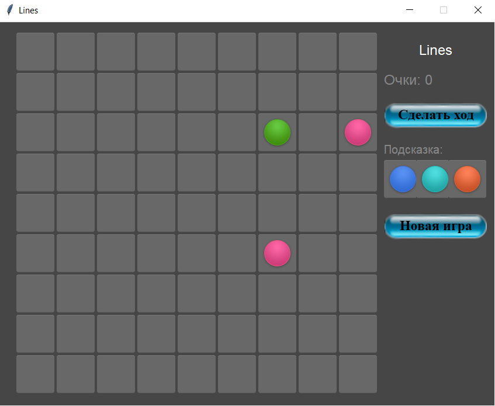

МИНИСТЕРСТВО НАУКИ  И ВЫСШЕГО ОБРАЗОВАНИЯ РОССИЙСКОЙ ФЕДЕРАЦИИ 
Федеральное государственное автономное образовательное учреждение высшего образования 
"КРЫМСКИЙ ФЕДЕРАЛЬНЫЙ УНИВЕРСИТЕТ им. В. И. ВЕРНАДСКОГО" 
ФИЗИКО-ТЕХНИЧЕСКИЙ ИНСТИТУТ 
Кафедра компьютерной инженерии и моделирования

 
<h3 align="center">Отчёт по лабораторной работе № 3  по дисциплине "Программирование"</h3>
  

студента 1 курса группы ПИ-б-о-201(1) 
Юращик Николай Александрович 
направления подготовки 09.03.04 "Программная инженерия"

  
<table>
<tr><td>Научный руководитель  старший преподаватель кафедры  компьютерной инженерии и моделирования</td>
<td>(оценка)</td>
<td>Чабанов В.В.</td>
</tr>
</table>
  

Симферополь, 2020

# Лабораторная работа №3 Lines
**Цель работы:** 
1.  Закрепить навыки разработки программ с простым графическим интерфейсом пользователя на языке Python при помощи библиотеки Tkinter;
2.  Получить представление о разработке простых игровых приложений.
**Постановка задачи:**
1.  Используя стандартный модуль для разработки программ с графическим интерфейсом Tkinter реализуйте игру Lines на зыке Python.
2.  В качестве образца графического интерфейса используйте данную игру.

## Ход работы

## Выполнение работы

Для начала необходимо создать игровое поле, главный критерий - оно должно легко редактироваться в реальном времени. Поэтому было решено использовать объект Canvas, который был помещен в корневой frame, где и производятся все изменения. Каждая клетка - экземпляр класса, содержащий цвет, размер, состояние, активность и идентификатор объекта canvas. Далее реализована функция, которая генерирует новые картинки на основе полей экземпляра каждого объекта и заменяет их на Canvas по уникальному идентификатору.

После создания игрового поля реализуем информационную панель справа:
- название игры
- количество очков
- подсказка
- кнопки "Сделать ход" и "Новая игра"

Для счета очков использована функция updateScore(), которая обновляла текст по нужному id.

Далее создаем функции для реализации подсказки:
- проверяем, можно ли разместить шарики на поле (хватает ли ячеек), если нет, завершаем игру
- генерируем 3 случайных шарика и помещаем их в глобальную переменную
- заполняем подсказку на игровом поле, для чего берем данные из глобальной переменной

Кнопка "Сделать ход" размещает шары из подсказки и выполняет генерацию новой.
Кнопка "Новая игра" очищает поле, генерирует подсказку, после чего размещает ее на поле и генерирует новую.

Если игрок активировал ячейку с шариком (путем нажатия на данную клетку, после чего меняется ее фон на более светлый), а далее нажал на любую пустую ячейку, вызывается функция, которая проводит анализ, можно ли из исходной клетки добраться до конечной, используя пустые клетки, или что-то препятствует. В первом случае шарик перемещается в конечную точку и происходит проверка на 5 и более одинаковых шариков в ряд, столбец и диагональ. Если таковые присутствуют, то линия из этих шаров очищается и увеличивается количество очков игрока (за каждый шар по 2 очка), иначе, на поле размещаются шарики из подсказки. Функция реализована с помощью массивов массивов из ссылок на клетки игрового поля по вертикали, горизонтали и диагонали. Во втором случае ничего не происходит и игра ждет пока пользователь нажмет на другую клетку.

Скриншоты игрового процесса:

Рисунок 1. Начало игры

Рисунок 2. Собрано несколько линий

Рисунок 3. Игра окончена, так как нет свободных клеток

[Исходный код на Python](./Lab/03/lines.py)

## Вывод
Я закрепил навыки разработки программ с простым графическим интерфейсом на языке Python при помощи библиотеки Tkinter, используя объекты canvas, label, button и прочие, а также получил представление о разработке простых игровых приложений.